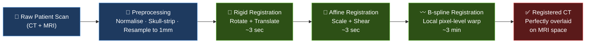
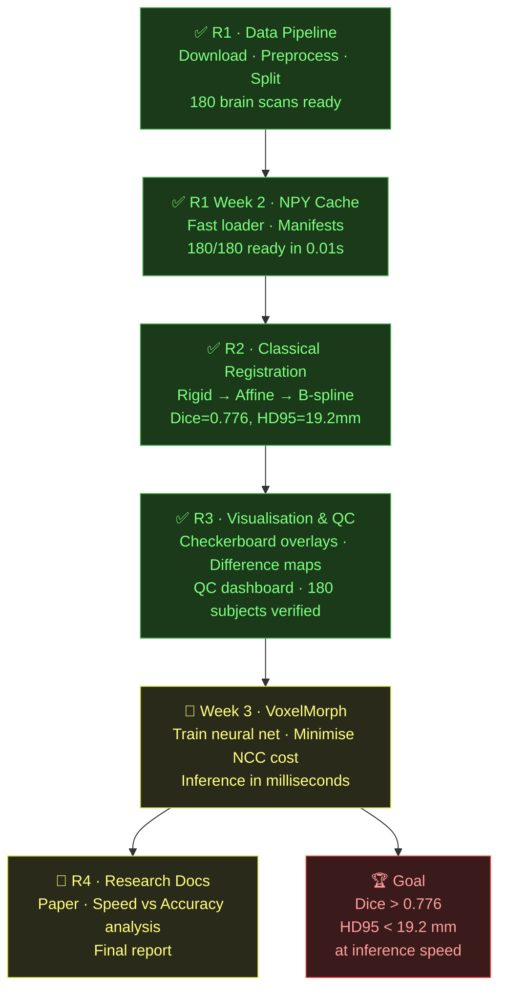

# 🧠 DeepMedAlign

> **Aligning CT and MRI brain scans — pixel by pixel — using classical registration and deep learning.**

Medical imaging generates two fundamentally different views of the same patient: **MRI** captures soft tissue detail, **CT** guides treatment planning. Before clinicians can use them together, these scans must be precisely aligned. DeepMedAlign automates that process — from raw NIfTI files to a perfectly warped, voxel-registered output — at scale, on 180 real patient brain scans.

---

## 🎯 What It Does

Takes a patient's CT scan and warps it to match their MRI — millimetre by millimetre — so both scans occupy the same coordinate space and can be overlaid perfectly. The alignment is evaluated using a cost function (Normalized Cross-Correlation) that is minimised to reduce registration error.



---

## 📊 Baseline Results (Classical Registration)

Evaluated on **180 subjects** (all splits) from the [SynthRad 2023](https://synthrad2023.grand-challenge.org/) brain dataset.  
B-spline evaluated on **125 training subjects only** (train split).

| Method | Subjects | Dice ↑ | HD95 (mm) ↓ | NCC ↑ |
|--------|----------|--------|-------------|-------|
| Rigid | 180 | 0.774 ± 0.064 | 19.5 ± 8.2 | -0.285 ± 0.106 |
| Affine | 180 | 0.775 ± 0.064 | 19.5 ± 8.3 | -0.288 ± 0.109 |
| **B-spline** | **125** | **0.776 ± 0.059** | **19.2 ± 7.6** | **-0.318 ± 0.130** |

> These are the **baseline floor numbers**. The Week 3 VoxelMorph deep learning model must beat them to be clinically meaningful.
>
> **Target:** Dice > 0.776 · HD95 < 19.2 mm · Inference in milliseconds (vs ~3 min for B-spline)

---

## 🗂️ Dataset

- **Source:** SynthRad 2023 — Task 1 (MR → CT brain registration)
- **Subjects:** 180 total — 125 train / 19 val / 36 test
- **Resolution:** 160 × 192 × 160 @ 1 mm isotropic
- **Modalities:** T1-weighted MRI + Planning CT (Hounsfield Units)
- **Formats:** NIfTI (`.nii.gz`) for registration · NumPy (`.npy`) for fast deep learning loading

> ⚠️ Raw data (~15 GB) is **not tracked in git**. Download from SynthRad and place under `data/raw/synthrad/brain/`.

---

## 🚀 Quick Start

```powershell
# 1. Set up environment
python -m venv .venv
.\.venv\Scripts\Activate.ps1
pip install -r requirements.txt

# 2. Run preprocessing on all 180 subjects (skip if already done)
python scripts\run_preprocessing_batch.py --resume --no-hdbet

# 3. Run classical registration (rigid + affine, all subjects)
python scripts\run_classical.py --no-bspline

# 4. Build NPY cache for fast Week 3 training (~96 seconds)
python scripts\build_npy_cache.py --verify

# 5. Compute baseline metrics
python scripts\compute_baseline_metrics.py --method bspline --split train

# 6. Run QC visualisations
python scripts\checkerboard_qc.py --method affine
python scripts\visualize_difference_maps.py --method affine

# 7. Run all tests
python -m pytest tests\ -v
```

---

## 🗺️ Roadmap

| Phase | Branch | Status |
|-------|--------|--------|
| R1 — Data Pipeline | `r1/data-pipeline` | ✅ Done |
| R1 Week 2 — NPY Cache + Manifests | `r1/week2-data-pipeline` | ✅ Done |
| R2 — Classical Registration | `r2/week2-classical-registration` | ✅ Done |
| R3 — Visualisation & QC | `r3/week2-visualization` | ✅ Done |
| Week 3 — VoxelMorph (Deep Learning) | `r2/week3-voxelmorph` | 🔲 Upcoming |
| R4 — Research Docs & Final Report | `r4/research-docs` | 🔲 Upcoming |



---

## 🏗️ Project Structure

```
DeepMedAlign/
├── data/
│   ├── raw/                   # Manifests & CSVs (tracked) · SynthRad source (NOT tracked)
│   │   ├── manifest_final.csv
│   │   ├── manifest_processed.csv
│   │   ├── manifest_registered.csv
│   │   ├── npy_cache_report.csv
│   │   └── data_status_report.csv
│   └── processed/             # Normalised NIfTI + NPY cache (NOT tracked, ~15 GB)
├── results/
│   ├── baseline_metrics_rigid.csv
│   ├── baseline_metrics_affine.csv
│   ├── baseline_metrics_bspline.csv
│   └── figures/               # Checkerboard PNGs · Difference maps · QC dashboard
├── scripts/                   # Run registration, preprocessing, cache, metrics, QC
├── src/                       # Core library: config, classical_reg, metrics, utils
├── tests/                     # Unit tests — run with: pytest tests/ -v
├── docs/                      # Per-phase technical documentation
└── logs/                      # Runtime logs (NOT tracked)
```

---

## 🔬 Cost Function & Optimisation

Registration quality is measured and minimised using three metrics:

| Metric | What it measures | Better when |
|--------|-----------------|-------------|
| **NCC** (Normalized Cross-Correlation) | Intensity similarity between MRI and CT | Closer to 1.0 |
| **Dice** | Overlap of brain masks after alignment | Closer to 1.0 |
| **HD95** (Hausdorff Distance 95th percentile) | Max misalignment between brain boundaries | Closer to 0 mm |

In **classical registration**, these metrics are minimised iteratively by a mathematical optimiser.  
In **Week 3 VoxelMorph**, NCC becomes the **training loss function** — the neural network learns to minimise it automatically through backpropagation.

---

## 🤝 Contributing

- **Never commit directly to `main`** — open a PR at the end of each day
- Keep `main` runnable at all times
- Branch naming: `r{id}/short-description`
- **Never stage `.nii.gz`, `.npy`, or `.log` files** — they are in `.gitignore`

---

## 📄 License

Research use only. Dataset governed by [SynthRad 2023 terms](https://synthrad2023.grand-challenge.org/).