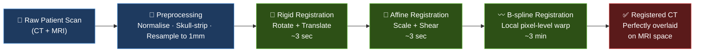
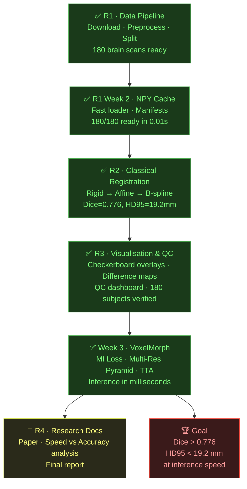

# 🧠 DeepMedAlign

> **Aligning CT and MRI brain scans — pixel by pixel — using classical registration and deep learning.**

Medical imaging generates two fundamentally different views of the same patient: **MRI** captures soft tissue detail, **CT** guides treatment planning. Before clinicians can use them together, these scans must be precisely aligned. DeepMedAlign automates that process — from raw NIfTI files to a perfectly warped, voxel-registered output — at scale, on 180 real patient brain scans.

---

## 🎯 What It Does

Takes a patient's CT scan and warps it to match their MRI — millimetre by millimetre — so both scans occupy the same coordinate space and can be overlaid perfectly. The alignment is evaluated using a cost function (Normalized Cross-Correlation) that is minimised to reduce registration error.



---

## 📊 Baseline Results (Classical Registration)

Evaluated on **180 subjects** (all splits) from the [SynthRad 2023](https://synthrad2023.grand-challenge.org/) brain dataset.  
B-spline evaluated on **125 training subjects only** (train split).

| Method | Subjects | Dice ↑ | HD95 (mm) ↓ | NCC ↑ |
|--------|----------|--------|-------------|-------|
| Rigid | 180 | 0.774 ± 0.064 | 19.5 ± 8.2 | -0.285 ± 0.106 |
| Affine | 180 | 0.775 ± 0.064 | 19.5 ± 8.3 | -0.288 ± 0.109 |
| **B-spline** | **125** | **0.776 ± 0.059** | **19.2 ± 7.6** | **-0.318 ± 0.130** |

> These are the **baseline floor numbers**. The Week 3 VoxelMorph deep learning model must beat them to be clinically meaningful.
>
> **Target:** Dice > 0.776 · HD95 < 19.2 mm · Inference in milliseconds (vs ~3 min for B-spline)

---

## 🗂️ Dataset

- **Source:** SynthRad 2023 — Task 1 (MR → CT brain registration)
- **Subjects:** 180 total — 125 train / 19 val / 36 test
- **Resolution:** 160 × 192 × 160 @ 1 mm isotropic
- **Modalities:** T1-weighted MRI + Planning CT (Hounsfield Units)

> ⚠️ Raw data (~15 GB) is **not tracked in git**. Download from SynthRad and place under `data/raw/synthrad/brain/`.

### 🧊 3D Image Format — NIfTI vs NumPy

Each brain scan in this project is a **true 3D image** (not a flat photo). It is a cube of **160 × 192 × 160 = ~4.9 million voxels** (3D pixels), where every voxel stores an intensity value at a specific (x, y, z) coordinate in the brain.

We use two formats depending on the task:

| Format | Extension | What it stores | Load time | Used for |
|--------|-----------|---------------|-----------|----------|
| **NIfTI** | `.nii.gz` | 3D image + spatial metadata (voxel size, orientation, affine matrix) | ~2 sec per scan | Classical registration (SimpleITK needs metadata) |
| **NumPy** | `.npy` | Raw 3D float32 array (pixel values only, no metadata) | ~0.01 sec per scan | Deep learning training (PyTorch reads arrays directly) |

**Why we convert NIfTI → NumPy for Week 3:**

During neural network training, the AI looks at each brain scan hundreds of times (once per training epoch). At 2 seconds per load × 125 scans × 100 epochs = **~7 hours just loading files**. After converting to `.npy`, the same operation takes **~13 minutes**. The conversion is done once by `scripts/build_npy_cache.py` and stored in `data/processed/<subject_id>/`.

---

## 🚀 Quick Start

```powershell
# 1. Set up environment
python -m venv .venv
.\.venv\Scripts\Activate.ps1
pip install -r requirements.txt

# 2. Run preprocessing on all 180 subjects (skip if already done)
python scripts\run_preprocessing_batch.py --resume --no-hdbet

# 3. Run classical registration (rigid + affine, all subjects)
python scripts\run_classical.py --no-bspline

# 4. Build NPY cache for fast Week 3 training (~96 seconds)
python scripts\build_npy_cache.py --verify

# 5. Compute baseline metrics
python scripts\compute_baseline_metrics.py --method bspline --split train

# 6. Run QC visualisations
python scripts\checkerboard_qc.py --method affine
python scripts\visualize_difference_maps.py --method affine

# 7. Run all tests
python -m pytest tests\ -v
```

---

## 🗺️ Roadmap

| Phase | Branch | Status |
|-------|--------|--------|
| R1 — Data Pipeline | `r1/data-pipeline` | ✅ Done |
| R1 Week 2 — NPY Cache + Manifests | `r1/week2-data-pipeline` | ✅ Done |
| R2 — Classical Registration | `r2/week2-classical-registration` | ✅ Done |
| R3 — Visualisation & QC | `r3/week2-visualization` | ✅ Done |
| Week 3 — VoxelMorph (Deep Learning) | `r2/week3-voxelmorph` | ✅ Done |
| R4 — Research Docs & Final Report | `r4/research-docs` | 🔲 Upcoming |



---

## 🏗️ Project Structure

```
DeepMedAlign/
├── data/
│   ├── raw/                   # Manifests & CSVs (tracked) · SynthRad source (NOT tracked)
│   │   ├── manifest_final.csv
│   │   ├── manifest_processed.csv
│   │   ├── manifest_registered.csv
│   │   ├── npy_cache_report.csv
│   │   └── data_status_report.csv
│   └── processed/             # Normalised NIfTI + NPY cache (NOT tracked, ~15 GB)
├── results/
│   ├── baseline_metrics_rigid.csv
│   ├── baseline_metrics_affine.csv
│   ├── baseline_metrics_bspline.csv
│   └── figures/               # Checkerboard PNGs · Difference maps · QC dashboard
├── scripts/                   # Run registration, preprocessing, cache, metrics, QC
├── src/                       # Core library: config, classical_reg, metrics, utils
├── tests/                     # Unit tests — run with: pytest tests/ -v
├── docs/                      # Per-phase technical documentation
└── logs/                      # Runtime logs (NOT tracked)
```

---

## 🔬 Cost Function & Optimisation

Registration quality is measured and minimised using three metrics:

| Metric | What it measures | Better when |
|--------|-----------------|-------------|
| **NCC** (Normalized Cross-Correlation) | Intensity similarity between MRI and CT | Closer to 1.0 |
| **Dice** | Overlap of brain masks after alignment | Closer to 1.0 |
| **HD95** (Hausdorff Distance 95th percentile) | Max misalignment between brain boundaries | Closer to 0 mm |

In **classical registration**, these metrics are minimised iteratively by a mathematical optimiser.  
In **Week 3 VoxelMorph**, NCC becomes the **training loss function** — the neural network learns to minimise it automatically through backpropagation.

---

## 📐 Formulas Used

### 1. Normalized Cross-Correlation (NCC) — Primary Cost Function

Measures how similar the intensity patterns of the MRI and registered CT are:

```
         Σ [ (I(x) - μ_I) · (J(x) - μ_J) ]
NCC  =  ─────────────────────────────────────
            √[ Σ(I(x) - μ_I)² · Σ(J(x) - μ_J)² ]
```

Where:
- `I(x)` = MRI intensity at voxel x
- `J(x)` = CT intensity at voxel x (after warping)
- `μ_I`, `μ_J` = mean intensities of MRI and CT
- Range: −1 (perfectly anti-correlated) to +1 (perfectly correlated)
- **Goal:** Maximise NCC (minimise −NCC as the loss)

---

### 2. Dice Similarity Coefficient — Overlap Metric

Measures how well the brain masks overlap after registration:

```
        2 · |A ∩ B|
Dice = ─────────────
          |A| + |B|
```

Where:
- `A` = brain mask voxels from MRI
- `B` = brain mask voxels from registered CT
- `|A ∩ B|` = number of voxels where both masks are 1
- Range: 0.0 (no overlap) to 1.0 (perfect overlap)
- **Goal:** Dice > 0.776 (beat the B-spline baseline)

---

### 3. Hausdorff Distance 95th Percentile (HD95) — Boundary Error

Measures the worst-case misalignment between brain boundaries (ignoring the top 5% of outliers):

```
HD95(A, B) = max( P95{ min dist(a, B) }, P95{ min dist(b, A) } )
```

Where:
- `dist(a, B)` = shortest distance from boundary point `a` in A to any boundary point in B
- `P95` = 95th percentile (ignores the 5% worst outliers)
- Unit: millimetres
- **Goal:** HD95 < 19.2 mm (beat the B-spline baseline)

---

## 🧠 Deep Learning Architecture (Week 3)

The **VoxelMorph** neural network was implemented with state-of-the-art enhancements for robust MRI-CT multimodal registration:

1. **Mutual Information (MI) Loss:** Replaced standard MSE/MIND with a differentiable Parzen-window MI estimator, the gold standard for multimodal medical image registration.
2. **Multi-Resolution DVF Pyramid:** The Deformation Vector Field (DVF) is accumulated coarse-to-fine across three decoder scales (1/4, 1/2, and full resolution) to align global structures before local details.
3. **Diffeomorphic Integration:** Uses a scaling-and-squaring layer (7 steps) to guarantee a smooth, fold-free displacement field that preserves anatomical topology.
4. **Test-Time Adaptation (TTA):** During inference, the network fine-tunes on each unseen test patient for 30 steps to maximize patient-specific accuracy.
5. **High-Performance Training:** Leverages PyTorch `torch.compile` and Automatic Mixed Precision (AMP) to achieve ~90s epochs on a Kaggle T4 GPU.

---

## 🤝 Contributing

- **Never commit directly to `main`** — open a PR at the end of each day
- Keep `main` runnable at all times
- Branch naming: `r{id}/short-description`
- **Never stage `.nii.gz`, `.npy`, or `.log` files** — they are in `.gitignore`

---

## 📄 License

Research use only. Dataset governed by [SynthRad 2023 terms](https://synthrad2023.grand-challenge.org/).