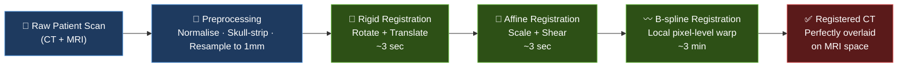
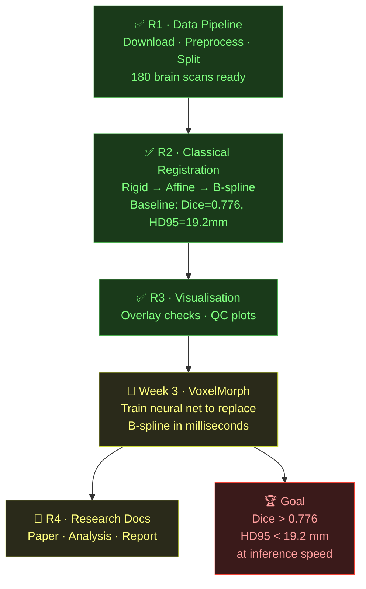

# 🧠 DeepMedAlign

> **Aligning CT and MRI brain scans — pixel by pixel — using classical registration and deep learning.**

Medical imaging generates two fundamentally different views of the same patient: **MRI** captures soft tissue detail, **CT** guides treatment planning. Before clinicians can use them together, these scans must be precisely aligned. DeepMedAlign automates that process — from raw DICOM to a perfectly warped, voxel-registered output — at scale, on 180 real patient brain scans.

---

## 🎯 What It Does

Takes a patient's CT scan and warps it to match their MRI — millimetre by millimetre — so both scans occupy the same coordinate space and can be overlaid perfectly.



---

## 📊 Baseline Results (Classical Registration)

Evaluated on **125 training subjects** from the [SynthRad 2023](https://synthrad2023.grand-challenge.org/) brain dataset.

| Method | Dice ↑ | HD95 (mm) ↓ |
|--------|--------|-------------|
| Rigid | — | — |
| Affine | — | — |
| **B-spline** | **0.776 ± 0.059** | **19.2 ± 7.6** |

> These are the **floor numbers**. The deep learning model (Week 3) must beat them to be clinically meaningful.

---

## 🗂️ Dataset

- **Source:** SynthRad 2023 — Task 1 (MR → CT synthesis / registration)
- **Subjects:** 180 (125 train / 27 val / 28 test)
- **Resolution:** 160 × 192 × 160 @ 1 mm isotropic
- **Format:** NIfTI (`.nii.gz`), normalised and skull-stripped

> ⚠️ Raw data (~15 GB) is **not tracked in git**. Download from SynthRad and place under `data/raw/synthrad/brain/`.

---

## 🚀 Quick Start

```powershell
# 1. Set up environment
python -m venv .venv
.\.venv\Scripts\Activate.ps1
pip install -r requirements.txt

# 2. Run classical registration (train split)
python scripts\run_classical.py --split train

# 3. Compute baseline metrics
python scripts\compute_baseline_metrics.py --method bspline --split train
```

---

## 🗺️ Roadmap

| Phase | Branch | Status |
|-------|--------|--------|
| R1 — Data Pipeline | `r1/data-pipeline` | ✅ Done |
| R2 — Classical Registration | `r2/week2-classical-registration` | ✅ Done |
| R3 — Visualisation | `r3/preprocess-viz` | ✅ Done |
| R4 — Research Docs | `r4/research-docs` | 🔲 Upcoming |
| Week 3 — VoxelMorph (Deep Learning) | `r2/week3-voxelmorph` | 🔲 Upcoming |



---


## 🏗️ Project Structure

```
DeepMedAlign/
├── data/
│   ├── raw/           # Manifests & SynthRad source (data not tracked)
│   └── processed/     # Normalised scans & registration outputs (not tracked)
├── results/           # Metrics CSVs — the numbers that matter
├── scripts/           # Run registration, compute metrics, build manifests
├── src/               # Core library (config, classical_reg, metrics, utils)
├── notebooks/         # Exploration & visualisation
└── tests/             # Unit tests — run with pytest tests/ -v
```

---

## 🤝 Contributing

- **Never commit directly to `main`** — open a PR at the end of each day
- Keep `main` runnable at all times
- Branch naming: `r{id}/short-description`

---

## 📄 License

Research use only. Dataset governed by [SynthRad 2023 terms](https://synthrad2023.grand-challenge.org/).